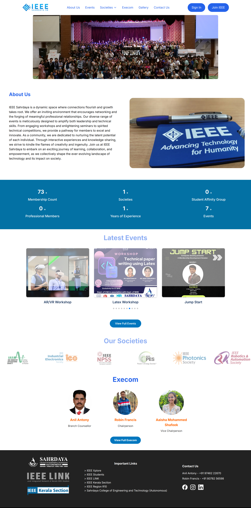
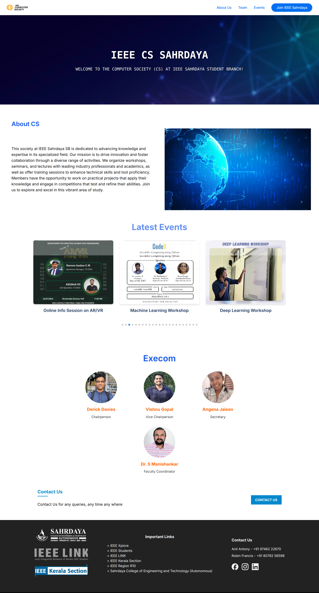
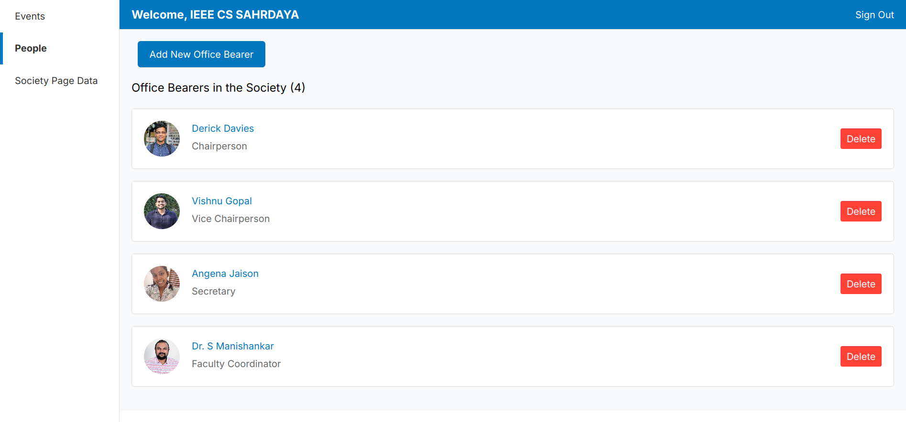
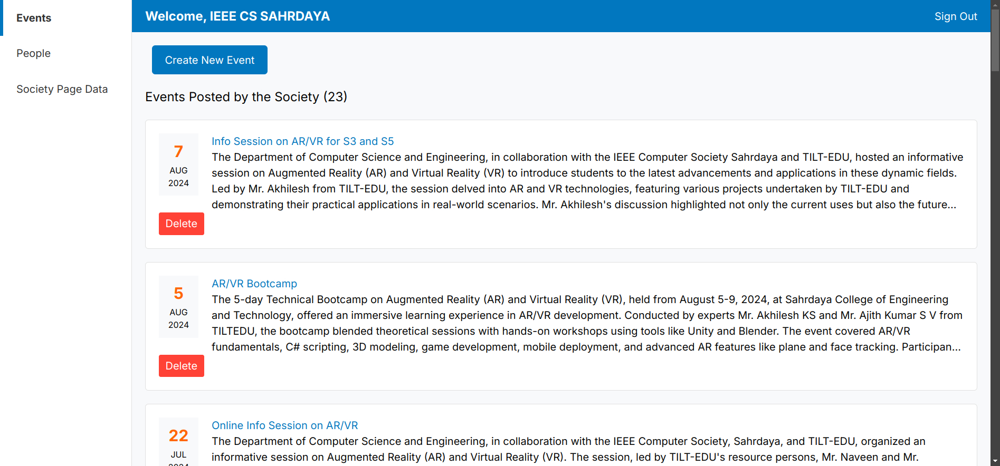
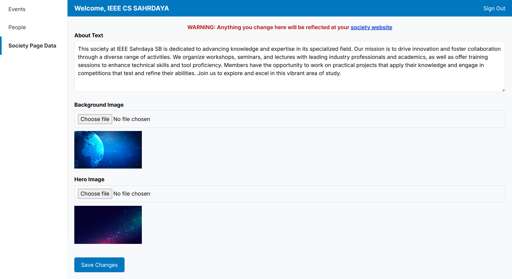

# IEEE Sahrdaya SB Website

A modern, responsive website for IEEE Sahrdaya Student Branch built with Next.js, styled-components, and Firebase.

## 📸 Screenshots


### Public Pages
| Home Page | Society Page |
|-----------|--------------|
|  |  |

### Admin Dashboard
| Office Admin | Events Admin | Society Admin |
|--------------|--------------|---------------|
|  |  |  |


## 🌟 Features

- **Dynamic Content Management**: Firebase-powered dashboard for society admins
- **Responsive Design**: Fully responsive across all devices
- **Interactive UI**: Smooth animations and transitions using Framer Motion
- **Real-time Updates**: Live event updates and society information
- **Image Optimization**: Next.js Image component for optimal loading
- **SEO Friendly**: Built with SEO best practices

## 🛠️ Tech Stack

- **Frontend**: Next.js 13+ (App Router)
- **Styling**: 
  - Styled Components
  - Tailwind CSS
- **Animation**: Framer Motion
- **Carousel**: Swiper.js
- **Backend**: Firebase
  - Authentication
  - Firestore
  - Storage
- **Deployment**: Vercel

## 📱 Sections

- **Home Page**
  - Hero Section with Image Slider
  - About Section
  - Latest Events
  - Society Logos Carousel
  - Informant Section (Statistics)
  - Footer with Important Links

- **Societies Page**
  - Custom Hero Section
  - Society-specific Navigation
  - Contact Section
  - Events Display

- **Dashboard**
  - Society Management
  - Content Updates
  - Image Upload

## 🚀 Getting Started

1. Clone the repository:

```
git clone https://github.com/IEEE-SAHRDAYA/website.git
```
2. Install dependencies:

```
npm install
```
3. Run the development server:

```
npm run dev
```


## 📂 Project Structure

```
src/
├── app/ # Next.js app router pages
├── components/ # Reusable components
├── sections/ # Page sections
│ ├── HomePage/ # Home page sections
│ └── SocietiesPage/ # Society page sections
├── utils/ # Utility functions
└── styles/ # Global styles
```

## 👨‍💻 Development Guide

### Firebase Setup

#### Authentication
- Uses Email/Password authentication for society admins
- Admin emails must be pre-registered in Firebase Auth

#### Firestore Collections Structure

```
// Collection: events
{
id: "auto-generated",
title: String,
description: String,
date: String, // Format: "YYYY-MM-DD"
society: String, // Society code (e.g., "cs", "wie")
mediaPath: String // URL to event poster in imgbb
}
```
```
// Collection: people (execom)
{
id: "auto-generated",
name: String,
role: String,
society: String, // Society code
photoPath: String // URL to profile photo
}
```
```
// Collection: societies
{
id: String, // Society code (e.g., "cs")
about: String, // Society description
backgroundImage: String, // URL to background image
heroImage: String, // URL to hero section image
email: String // Society contact email
}

```


### Society Codes Reference

```
const SOCIETIES_MAP = [
{ code: "cas", name: "Circuits and Systems Society" },
{ code: "cs", name: "Computer Society" },
{ code: "css", name: "Control Systems Society" },
{ code: "edsoc", name: "Education Society" },
{ code: "embs", name: "Engineering in Medicine and Biology Society" },
{ code: "ias", name: "Industry Applications Society" },
{ code: "ies", name: "Industrial Electronics Society" },
{ code: "npss", name: "Nuclear and Plasma Sciences Society" },
{ code: "pes", name: "Power and Energy Society" },
{ code: "ps", name: "Photonics Society" },
{ code: "ras", name: "Robotics and Automation Society" },
{ code: "sight", name: "Special Interest Group on Humanitarian Technology" },
{ code: "sps", name: "Signal Processing Society" },
{ code: "wie", name: "Women In Engineering" }
];
```

## Environment Variables

Create a `.env` file in the root directory with the following variables:

```
NEXT_PUBLIC_IMGBB_API_KEY=IMGBB_API_KEY
```

## 🤝 Contributing

Contributions are welcome! Please feel free to submit a Pull Request.

## 📄 License

This project is licensed under the MIT License - see the [LICENSE](LICENSE) file for details.

## 📞 Contact

For any queries, contact us on ieee@sahrdaya.ac.in

## 🔗 Links

- [Website](https://ieeesahrdaya.com)
- [Facebook](https://www.facebook.com/Ieeesahrdaya/)
- [Instagram](https://www.instagram.com/Ieeesahrdaya/)
- [LinkedIn](https://www.linkedin.com/company/ieeesahrdaya)

